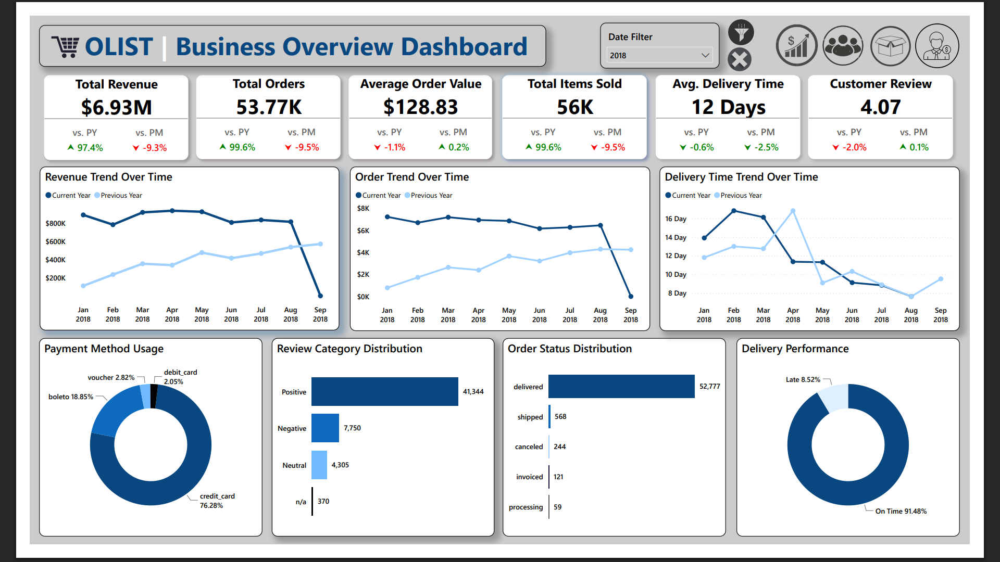
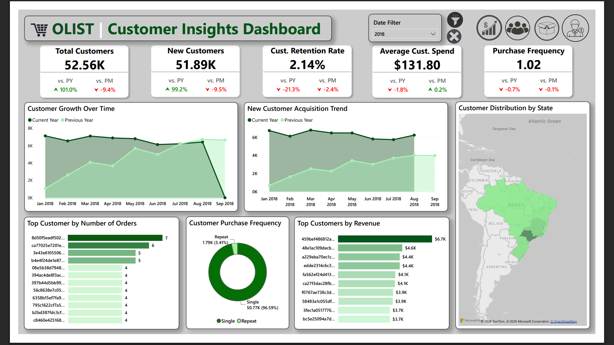
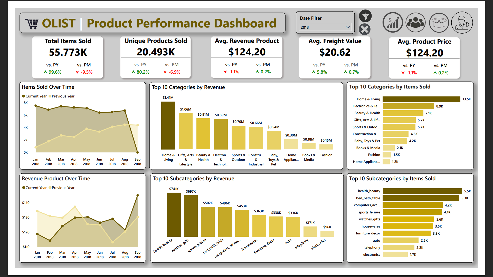
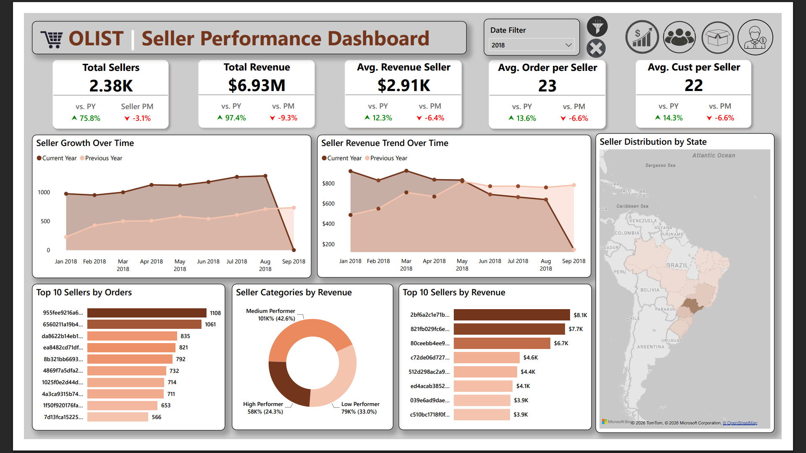

# Olist Ecommerce Analysis
**Olist** is an e-commerce platform that operates as a marketplace by connecting sellers and customers across Brazil. The platform helps sellers market and sell their products to a wider audience while making it easier for customers to search for, compare, and purchase a wide variety of products online. In addition to providing transaction services, **Olist** also supports operational processes such as order management, payment, and shipping, creating a more convenient shopping experience for customers and a more efficient selling process for sellers.
## Project Overview
This project aims to explore transaction data from the Olist platform to gain insights into overall business performance. The analysis is conducted by processing the data into several dashboards that present information from various perspectives to answer different business questions and identify additional insights that support decision-making.
## Business Problem
E-commerce platforms generate large volumes of transaction data that cover various operational aspects, such as sales, customers, sellers, products, payments, and shipping. Without an analysis process, this data is difficult to utilize for obtaining information that supports decision-making. Therefore, an analysis is needed to provide a comprehensive overview of business performance, understand customer behavior, evaluate seller and product performance, and also evaluate operational processes such as payments and shipping to identify opportunities for improving efficiency and service quality.
## Dataset Description
This project uses the Brazilian E-Commerce Public Dataset by Olist, a dataset containing approximately 100,000 orders during the 2016–2018 period. The dataset consists of several related tables, including customer data (customers), seller data (sellers), order data (orders), order item details (order_items), payment data (order_payments), customer reviews (order_reviews), product data (products), product categories (product_category_name_translation), and geolocation data (geolocation). In addition, the dataset contains information on order status, order and delivery timestamps, product prices, freight costs, as well as customer ratings and reviews submitted after transaction is completed.
## Data Cleaning & Transformation
Before the analysis process was conducted, the dataset first goes through a data cleaning and data transformation stage to ensure the quality and consistency of the data used. This stage includes handling missing values, standardizing data formats, cleaning invalid data, and transforming the data into a structure suitable for analysis. A more detailed explanation of this process can be found in the [Olist Data Warehouse] project.
## Data Modeling
The data used in this analysis was modeled in the Olist Data Warehouse project using a dimensional schema (dimensional modeling). This process produced a data structure consisting of fact tables and dimension tables that have been optimized for data analysis and visualization. Details regarding the data model and the relationships between tables can be found in the [Olist Data Warehouse] project.
## Dashboard Overview
### Business Overview Dashboard

### Key Insights & Business Recommendation
- Significant business growth compared to the previous year (over 95%), both in terms of total revenue, total orders, and total items sold.
  - _Maintaining the marketing and customer acquisition strategies that have driven this significant business growth._
- Although total revenue increased, the Average Order Value (AOV) decreased by $1.1%$ compared to the previous year, indicating that revenue growth was driven more by an increase in the number of transactions than by higher spending per transaction.
  - _Increasing the average transaction value through cross-selling strategies, product bundling, or relevant product recommendation._
- The average delivery time was 12 days, slightly faster than the previous year. Furthermore, 91.48% of orders were delivered on time, indicating strong logistics performance. However, there is still a considerable number of late deliveries.
  - _Maintain partnerships with high-performing logistics providers while identifying regions or sellers that experiencing frequent delays for further evaluation._
- The average customer rating reached 4.07 out of 5, with the majority of reviews classified as positive. However, there were still approximately 7,750 negative reviews, indicating room for improvement.
  - _Analyze the content of negative reviews to identify the root causes, such as delivery delays, product quality, or service-related issues._
- Approximately 76% of transactions used credit cards, while 19% were paid via boleto. Other payment methods are only used by a small proportion of customers.
  - _Optimize the credit card payment experience, as it is the primary payment method used by customers._
- Most orders were in the _Delivered_ status, while the number of canceled or still-processing orders was relatively small compared to the total number of transactions.
  - _Monitor the causes of order cancellations to minimize them and improve the efficiency of the order fulfillment process to reduce the number of orders remaining in the processing stage._

### Customer Insights Dashboard

### Key Insights & Business Recommendation
- The total number of customers reached $52.56 thousand, of which $51.89 thousand were new customers, while returning customers accounted for only about 2%.
  - _Further strategy development is needed to balance the focus between acquiring new customers and retaining existing ones._
- The average customer spending was $131.80, with 96.6% of the shopping frequency dominated by single-buyer customers, while only about 3.4% made repeat purchases.
  - _Increase purchase frequency and customer spending through personalized product recommendations, repurchase reminders, and loyalty programs. Additionally, use products with high repeat purchase potential as promotional targets for relevant customers._
- Customers are fairly evenly distributed across Brazil, although one region, São Paulo, had the highest number of customers.
  - _Maintain marketing strategies in regions with a high customer base while expanding efforts in regions with lower customer numbers but strong growth potential._
- There was one customer with a very high revenue contribution of approximately $6.7 thousand, while the other top customers contributed around $3.7–4.6 thousand.
  - _Identify and retain high-value customers through VIP customer programs or exclusive services to strengthen customer loyalty._

### Product Performance Dashboard

### Key Insights & Business Recommendation
- A total of $55.77 thousand products were sold, representing a 99.6% increase compared to the previous year. In addition, the number of unique products sold increased by 80.2%, indicating that a wider variety of products was successfully marketed.
  - _Maintain the product catalog expansion strategy, especially in high-demand categories._
- Although the average product price decreased by 1.1%, the average revenue per product increased to $338.02. This indicates that revenue growth was driven more by higher sales volume than by increases in product prices.
  - _Maintain the sales strategies that have successfully increased transaction volume, while optimizing profitability through upselling, cross-selling, product bundling, or premium product offerings without reducing price competitiveness._
- The **Home & Living** category generated the highest revenue ($1.41 million) and recorded the highest number of products sold (13.5 thousand units), indicating strong market demand for this category.
  - _Prioritize investment, promotional activities, and product assortment expansion for the **Home & Living** category._
- At the subcategory level, **Health & Beauty** generated the highest revenue ($741 thousand), while **Bed Bath Table** and **Computers Accessories** recorded higher sales volumes.
  - _Increase the value proposition and branding of high-value products, while focusing on inventory efficiency and operational optimization for high-volume products._
- The average shipping cost reached $20.62, representing a 5.8% increase compared to the previous year.
  - _Evaluate logistics costs and negotiate with shipping partners to better control shipping expenses._

### Seller Performance Dashboard

### Key Insights & Business Recommendations
- The platform had approximately 2.38 thousand active sellers, representing a 75.8% increase compared to the previous year. This indicates that more sellers joined the platform.
  - _Continue the seller acquisition strategy by simplifying the seller onboarding and recruitment process._
- The average revenue per seller reached $2.91 thousand, an increase of 12.3%. The average number of orders (23) and customers (22) served by each seller also increased by more than 13%, indicating that seller productivity improved alongside the platform's growth.
  - _Provide training, performance dashboards, and sales insights to help sellers improve their performance._
- The highest-performing seller generated approximately $8.1 thousand in revenue, while the other top-ranked sellers generated around $3.9–7.7 thousand.
  - _Retain high-performing sellers through incentive programs, rewards, or exclusive benefits, while supporting medium- and low-performing sellers with promotions, training, and business guidance._
- The majority of sellers were classified as Medium Performers and Low Performers.
  - _Focus on developing medium- and low-performing sellers through training, performance evaluations, and marketing support._
- The distribution map shows that sellers were concentrated in several states across Brazil, while other regions had relatively few or no sellers.
  - _Expand seller acquisition programs into regions with strong growth potential, while strengthening logistics and operational support in new regions to enable sellers to operate effectively._

## Conclusion
- Business performance showed very significant growth compared to the previous year across nearly all key indicators, including revenue, number of orders, and number of sellers.
- Although the number of new customers and transaction volume increased substantially, customer retention remained low and the average transaction value declined slightly. Therefore, the business should prioritize strategies focused on improving customer retention, increasing purchase frequency, raising the average transaction value, developing seller performance, optimizing product categories, and improving operational efficiency.
- A wide range of product categories and subcategories contributed the highest revenue, indicating opportunities to maximize the contribution of each category by increasing the value proposition and branding of high-value products while focusing on inventory efficiency and operational optimization for high-volume products.
- Not only did the number of sellers increase, but the average revenue, number of orders, and number of customers per seller also grew. However, seller distribution has not yet covered all regions of Brazil. This indicates that sellers have generally become more productive in leveraging the platform to increase sales, while also highlighting the need to expand seller coverage more evenly across the country.

